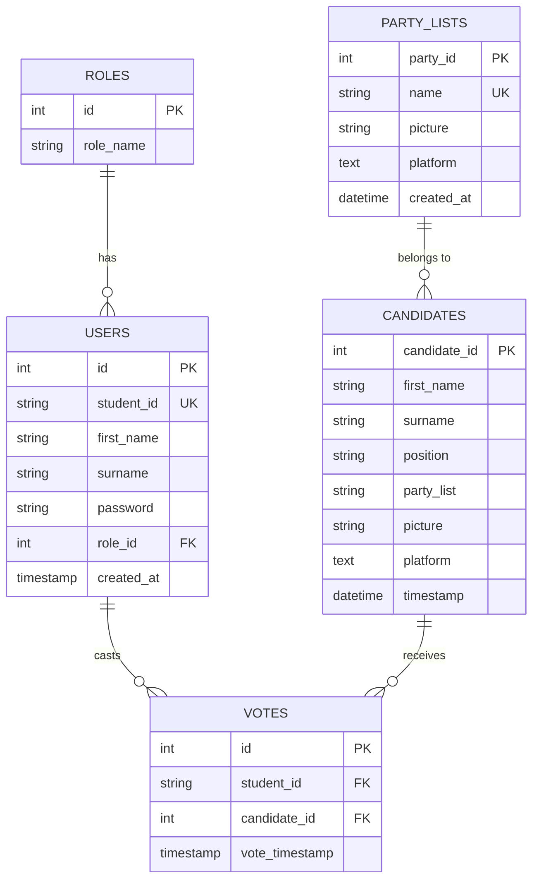

# 🗳️ ELECT - QCU Supreme Student Council Online Voting System

[](https://www.php.net/)
[](https://www.mysql.com/)
[](https://developer.mozilla.org/en-US/docs/Web/JavaScript)
[](https://jquery.com/)
[](https://developer.mozilla.org/en-US/docs/Web/HTML)
[](https://developer.mozilla.org/en-US/docs/Web/CSS)

> **ELECT** is a web-based electoral management and online voting platform designed for Quezon City University (QCU) Supreme Student Council (SSC) elections. It provides a modern, secure, and transparent digital voting experience for voters while offering robust administrative controls for election organizers.


## 🌟 Overview

Student elections require absolute integrity, usability, and accessibility. **ELECT** streamlines the election lifecycle at Quezon City University by eliminating paper-based ballots, enabling instant vote counting, providing voters with candidate platform visibility, and giving administrators full operational control over candidate listings, party lists, user roles, and voter logs.

---

## ✨ Key Features

### 🗳️ Voter Portal
* **Student Authentication**: Secure login using unique Student IDs and encrypted passwords.
* **Double-Voting Prevention**: Automated system verification preventing students who have already cast a vote from accessing the ballot.
* **Party List Showcase**: Browse competing political parties, their mission statements, platforms, and official logos.
* **Interactive Digital Ballot**: Dynamic candidate selection for positions such as:
  * President
  * Vice President for Operations
  * Vice President for Internal Affairs
  * Vice President for External Affairs
  * Executive Secretary
  * Treasurer
  * Auditor
  * Councilors (Membership, Internal Affairs, External Affairs, Logistics & Events, Information Dissemination, Documentaries & Reports)
* **Vote Confirmation & Thank-You Screen**: Confirmation receipt following successful ballot submission.

### 🛡️ Administrative Dashboard
* **Real-time Vote Monitoring & Tallying**: Automated, instantaneous aggregation of votes per candidate and position.
* **Printable Tally Reports**: One-click browser print integration (`window.print()`) for official election result archival.
* **Candidate Management**:
  * Add candidates with position selection, party affiliation, platform details, and image uploads.
  * Edit and update existing candidate profiles.
  * Archive candidate records to soft-delete without losing historic data.
* **Partylist Management**:
  * Create, edit, and manage party lists, platforms, and official emblems.
  * Soft-delete/archive obsolete party lists.
* **User & Role Management**:
  * Manage voter and administrator accounts.
  * Promote/demote user roles (Admin vs. Voter).
* **Archive Vault**: View and restore archived candidates, party lists, and user records.

### 🔒 Security & Integrity Safeguards
* **Password Encryption**: Sensitive user credentials hashed using standard `BCrypt` algorithms (`password_hash` & `password_verify`).
* **Prepared SQL Statements**: Defensive database access using `mysqli` and `PDO` prepared statements to neutralize SQL Injection vulnerabilities.
* **Copy/Paste Prevention**: Disabled clipboard paste/copy on sensitive login input fields to mitigate credential leakage.
* **Session Integrity & Back-Button Shielding**: Client-side navigation lock (`history.pushState`) preventing unauthorized form resubmission or post-logout navigation.

---

## 💻 Tech Stack

| Layer | Technology | Description |
| :--- | :--- | :--- |
| **Frontend Framework** | HTML5, CSS3, Vanilla JS | Custom responsive UI styling with Google Fonts (*Saira*, *Roboto*, *Unbounded*) |
| **Client Scripts** | jQuery 3.6.0, AJAX | Dynamic page updates, modal forms, and smooth scrolling animations |
| **Backend Runtime** | PHP 8.x | Procedural and Object-Oriented server logic, session handling, and authentication |
| **Database** | MySQL / MariaDB | Relational database management system with foreign key constraints |
| **Database Access** | PHP Data Objects (PDO) & `mysqli` | Prepared statement drivers for database querying |
| **Web Server** | Apache (XAMPP / WAMP / LAMP) | Local environment serving PHP scripts |

---

## 🗄️ Database Schema

The database `electovs` consists of core tables managing users, candidate entities, voting records, and archival tracking.



### Table Breakdown

1. `users`: Stores registered students and administrators (`role_id`: `0` = Admin, `1` = Voter).
2. `candidates`: Stores candidate names, running positions, party list affiliations, platform statements, and picture paths.
3. `party_lists`: Tracks registered political parties, emblems, and platforms.
4. `votes`: Tracks individual position selections per voter with foreign key cascade deletion for referential integrity.
5. `archived_candidates`, `archived_party_lists`, `archived_users`: Preserves soft-deleted records for audit trails and restoration.

---

## 📁 Project Directory Structure

```text
ELECT/
├── admin/                        # Administrative UI Views
│   ├── A_partylists.php          # Admin partylist views
│   ├── admin-dashboard.php       # Main Admin dashboard layout
│   └── admin.php                 # Sidebar navigation & AJAX module loader
├── backend/                      # Server-side APIs & Module Content
│   ├── HeaderAdmin.php           # Admin header template
│   ├── a-vote_monitoring.php     # Live vote tallies and printable report page
│   ├── add_candidate.php         # Candidate creation form & image upload handler
│   ├── add_party.php             # Party list creation handler
│   ├── add_user.php              # User registration handler
│   ├── archives.php              # Soft-deleted records management & restoration
│   ├── candidates_management.php # Candidate data table & controls
│   ├── dashboardcontent.php      # Admin analytics overview widgets
│   ├── db_connection.php         # Database configuration helper
│   ├── delete_candidate.php      # Candidate soft-delete / archive script
│   ├── delete_party.php          # Party list archive script
│   ├── delete_user.php           # User archive script
│   ├── edit_candidate.php        # Candidate modification form
│   ├── edit_party.php            # Party list modification form
│   ├── edit_user.php             # User modification form
│   ├── party_lists_management.php# Party list table & controls
│   └── user_management.php       # User table & role management
├── css/                          # Application Stylesheets
│   ├── ELECT-Styles.css          # Main voter portal stylesheet
│   ├── HeaderAdmin.css           # Admin navbar stylesheet
│   ├── admin.css                 # Admin dashboard layout styles
│   └── backend.css               # Management tables and modal styles
├── Main/                         # Core Voter Frontend Pages
│   ├── Header.php                # Voter navigation header
│   ├── SSC.php                   # Supreme Student Council info section
│   ├── about.php                 # About ELECT section
│   ├── animation.js              # UI interaction scripts
│   ├── footer.php                # Secondary footer
│   ├── footerindex.php           # Main portal footer
│   ├── home.php                  # Main landing page & authentication logic
│   └── login.php                 # Login widget template
├── Pics/                         # System Images & Candidate/Party Assets
│   ├── candidate_pictures/       # Uploaded candidate portraits
│   └── party_lists/              # Uploaded party list logos
├── sql/                          # Database Import Scripts
│   └── electovs.sql              # Database schema dump and initial seed data
├── Voter_db/                     # Voting System Modules
│   ├── partylists.php            # Party list showcase container
│   ├── partylists-info.php       # Detailed party list modal view
│   ├── thanks.php                # Post-voting confirmation screen
│   └── voter-form.php            # Digital ballot voting form
├── db_connection.php             # Root PDO database connection configuration
├── index.php                     # Application entry point
└── README.md                     # Project documentation
```

---

## ⚙️ Installation & Local Setup

### Prerequisites
* **Web Server**: [XAMPP](https://www.apachefriends.org/), WAMP, or any Apache + PHP 8.x environment.
* **Database Server**: MySQL 5.7+ or MariaDB 10.4+.
* **Web Browser**: Modern browser (Chrome, Firefox, Edge, Safari).

### Setup Instructions

1. **Clone or Download the Repository**
   Place the project folder in your web server's document root (e.g., `C:\xampp\htdocs\ELECT`):
   ```bash
   git clone https://github.com/your-username/ELECT.git
   ```

2. **Import Database Schema**
   * Open **phpMyAdmin** (`http://localhost/phpmyadmin`) or your MySQL client.
   * Create a new database named `electovs`:
     ```sql
     CREATE DATABASE electovs CHARACTER SET utf8mb4 COLLATE utf8mb4_general_ci;
     ```
   * Import the SQL file located at [`sql/electovs.sql`](file:///c:/Users/Justin/Desktop/Programming%20Stuff/SCHOOL%20PROJECTS/ELECT/sql/electovs.sql):
     ```bash
     mysql -u root -p electovs < sql/electovs.sql
     ```

3. **Configure Database Connection**
   Verify or update the connection settings in [`db_connection.php`](file:///c:/Users/Justin/Desktop/Programming%20Stuff/SCHOOL%20PROJECTS/ELECT/db_connection.php):
   ```php
   $servername = 'localhost';
   $dbname     = 'electovs';
   $username   = 'root';
   $password   = '';
   ```

4. **Launch the Application**
   * Start your Apache and MySQL modules in XAMPP.
   * Open your browser and navigate to:
     ```text
     http://localhost/ELECT/
     ```

---

## 🚀 Usage Workflow

### 1. Voter Flow
1. Navigate to the homepage (`http://localhost/ELECT/`).
2. Log in using your **Student ID** and **Password**.
3. View the Supreme Student Council information and explore available **Party Lists** and candidate platforms.
4. Click **VOTE NOW** to load the dynamic digital ballot.
5. Select your preferred candidates for each electoral position.
6. Submit your ballot to receive a vote confirmation. (Subsequent login attempts will detect the existing vote record and prevent double-voting).

### 2. Admin Flow
1. Log in with an administrator account (`role_id = 0`).
2. Access the **Admin Dashboard** (`/admin/admin-dashboard.php`).
3. Use the sidebar to navigate between:
   * **Dashboard**: Overview of voter participation metrics.
   * **Partylists Management**: Register new political parties and upload party emblems.
   * **Candidates Management**: Register candidates, set positions, and upload profile pictures.
   * **User Management**: Manage student voter accounts and administrative privileges.
   * **View Results**: Monitor incoming votes live by position and print certified tally reports.
   * **Archives**: Audit soft-deleted entries and restore records when necessary.

---

## 🔒 Security Audit & Safeguards Summary

| Threat Vector | Mitigation Strategy | Implementation Location |
| :--- | :--- | :--- |
| **SQL Injection (SQLi)** | PDO & MySQLi Prepared Statements with parameterized queries | [`Main/home.php`](file:///c:/Users/Justin/Desktop/Programming%20Stuff/SCHOOL%20PROJECTS/ELECT/Main/home.php), [`backend/`](file:///c:/Users/Justin/Desktop/Programming%20Stuff/SCHOOL%20PROJECTS/ELECT/backend) |
| **Credential Theft** | Password hashing via standard `BCrypt` | [`Main/home.php`](file:///c:/Users/Justin/Desktop/Programming%20Stuff/SCHOOL%20PROJECTS/ELECT/Main/home.php), [`backend/add_user.php`](file:///c:/Users/Justin/Desktop/Programming%20Stuff/SCHOOL%20PROJECTS/ELECT/backend/add_user.php) |
| **Double Voting** | Single-cast enforcement via `votes` table checks | [`Main/home.php`](file:///c:/Users/Justin/Desktop/Programming%20Stuff/SCHOOL%20PROJECTS/ELECT/Main/home.php), [`Voter_db/voter-form.php`](file:///c:/Users/Justin/Desktop/Programming%20Stuff/SCHOOL%20PROJECTS/ELECT/Voter_db/voter-form.php) |
| **Privilege Escalation** | Session-level `role_id` verification on administrative scripts | [`admin/admin-dashboard.php`](file:///c:/Users/Justin/Desktop/Programming%20Stuff/SCHOOL%20PROJECTS/ELECT/admin/admin-dashboard.php) |
| **Client-Side Tampering** | Disabled copy/paste events & history push state traps | [`Main/home.php`](file:///c:/Users/Justin/Desktop/Programming%20Stuff/SCHOOL%20PROJECTS/ELECT/Main/home.php) |

---

## 📜 License & Acknowledgments

* **Institution**: Quezon City University (QCU)
* **Project Scope**: Supreme Student Council (SSC) Online Voting System
* **Development**: Created for educational and electoral management purposes.

*For inquiries or system support, please contact the Quezon City University Supreme Student Council Electoral Committee.*
